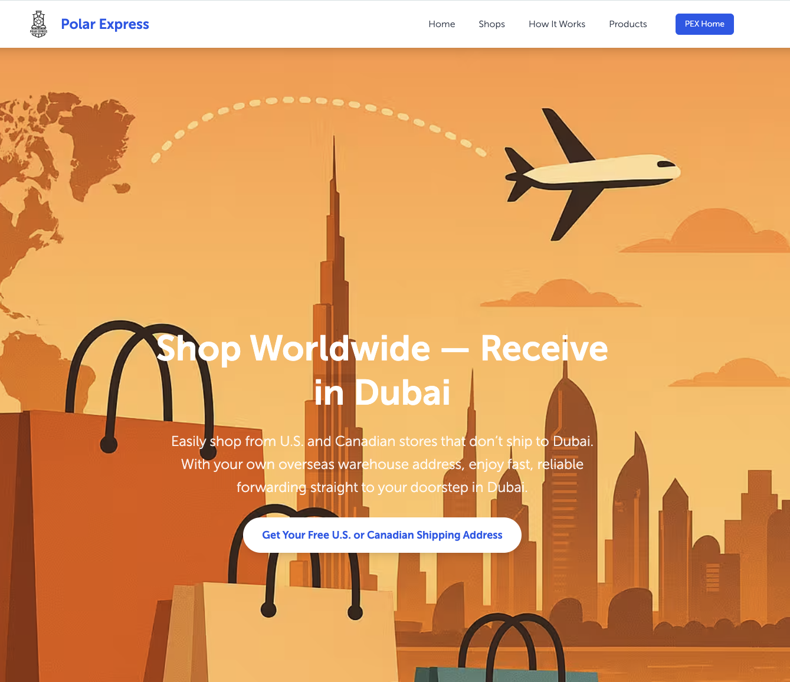

# PEX Dubai Landing Page

A modern, responsive landing page for **Polar Express**, promoting **shopping
with delivery from the USA, and Canada to Dubai**. This project is
built with **TailwindCSS** and **Alpine.js** for a clean, interactive, and fully
responsive user experience.

> 📌 Contract work completed for **PEX**

## ✨ Features

- **Multi-language Support**: Toggle between English and Russian for all content.
- **Sticky Navbar**: With smooth scrolling and a mobile-friendly menu.
- **Hero Section**: Featuring a prominent call-to-action and a background image
  of Dubai.
- **Shop Listings**: Categorized by country (USA, Canada) with logos and
  links.
- **"How It Works" Guide**: A 5-step visual guide explaining the service.
- **Product Showcase**: A grid of popular product categories.
- **Responsive Design**: Fully responsive layout using TailwindCSS.
- **Interactive Elements**: Powered by Alpine.js for the language switcher,
  mobile menu, and shop region tabs.

## 🧰 Tech Stack

- **HTML5**
- **TailwindCSS**
- **Alpine.js** (via CDN)
- **Swiper.js** (via CDN)
- **Custom Fonts**: `MuseoSansRegular.woff`, `MuseoSansBold.woff`

## 📁 Project Structure

```bash
.
├── index.html
├── package.json
├── README.md
├── assets/
│   ├── css/
│   │   ├── style.css
│   │   └── tailwind.css
│   ├── fonts/
│   │   ├── MuseoSansBold.woff
│   │   ├── MuseoSansRegular.woff
│   │   └── Normal.ttf
│   ├── images/
│   │   ├── goods/
│   │   ├── hero/
│   │   ├── shops/
│   │   └── steps/
│   └── logo/
│       ├── favicon.ico
│       └── logo.avif
└── README.md
```

## 📦 Installation & Usage

1.  **Clone the repository:**
    ```bash
    git clone git@github.com:DanilSidorov8625/PEX-Dubai-VA-Landing-Page.git
    ```
2.  **Navigate to the project directory:**
    ```bash
    cd PEX-Dubai-VA-Landing-Page
    ```
3.  **Install dependencies:**
    ```bash
    npm install
    ```
4.  **Run the TailwindCSS build command:**
    For development (watches for changes):
    ```bash
    npx tailwindcss -i ./assets/css/tailwind.css -o ./assets/css/style.css --watch
    ```
    For production (minifies the output):
    ```bash
    npx tailwindcss -i ./assets/css/tailwind.css -o ./assets/css/style.css --minify
    ```
5.  **Open `index.html` in your browser.**

No build step is required for JavaScript libraries as they are loaded via CDN.

## 📸 Preview



## 🙌 Credits

- **Creator**: Danil Sidorov
- **For**: PEX
